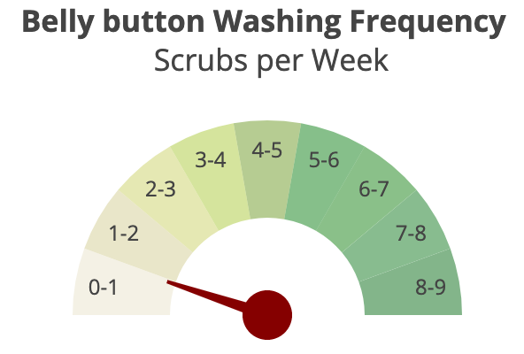

# Belly Button Biodiversity Visualization

Created an interactive dashboard to visualize information from the [Belly Button Biodiversity DataSet](http://robdunnlab.com/projects/belly-button-biodiversity/) from The Public Science Lab at North Carolina State University.

Application link: <https://belly-button-gu.herokuapp.com/>

## Table of contents

* [Technologies](#technologies)
* [Installation](#installation)
* [Development Process](#development-process)
* [Data Sources](#data-sources)
* [Contact](#contact)

## Technologies

* Python:
  * Flask - version 1.0.2
  * Flask-SQLAlchemy - version 2.3.2
  * Jinja2 - version 2.10.1
  * numpy - 1.14.5
  * pandas - 0.23.3
  * SQLAlchemy - 1.3.0
* Javascript:
  * d3 - version 5.5
  * Plotly - version 1.49.1
* HTML & CSS
  * Boostrap - version 4.3.1

## Installation and Usage

1. In a python 3 environment, `pip install requirements.txt`.

2. Run `app.py` to host the page locally.

3. When accessing the page, select a sample ID number from the dropdown menu to see the visualizations of that sample belly-button bacteria.

## Development Process

* Used Plotly.js to build interactive charts for a dashboard including:
  * Pie chart that displays the top 10 most populous bacteria from the sample.
  
  * Bubble chart that displays each bacteria present scaled to represent how large the bacteria is in that sample.
  
  * A gauge that displays the frequency per week with which the participant washed their belly-button.
  
* Used SQLAlchemy to connect to the SQLite database and query for the necessary data.
* Used Flask to create a RESTful API and to leverage Jinja2 to render the template with the visualizations.
* Launched dashboard as an app on Heroku: <https://belly-button-gu.herokuapp.com/>

## Data Sources

* sqlite database from the Belly Button Biodiversity DataSet <http://robdunnlab.com/projects/belly-button-biodiversity/> - A dataset of bacteria gathered from the belly-button of participants in a 2011 - 2012 study from The Public Science Lab at North Carolina State University.

## Contact

Created by [Gretel Uptegrove](https://gretelup.github.io/)
